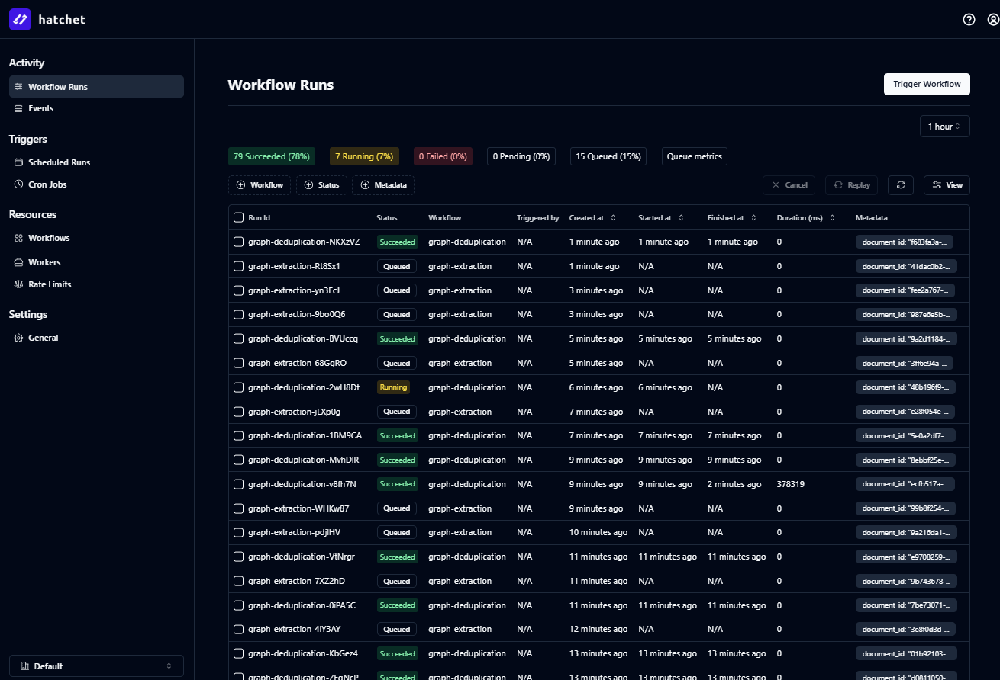
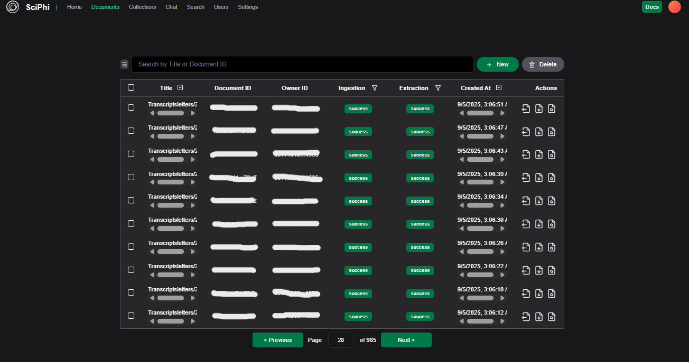
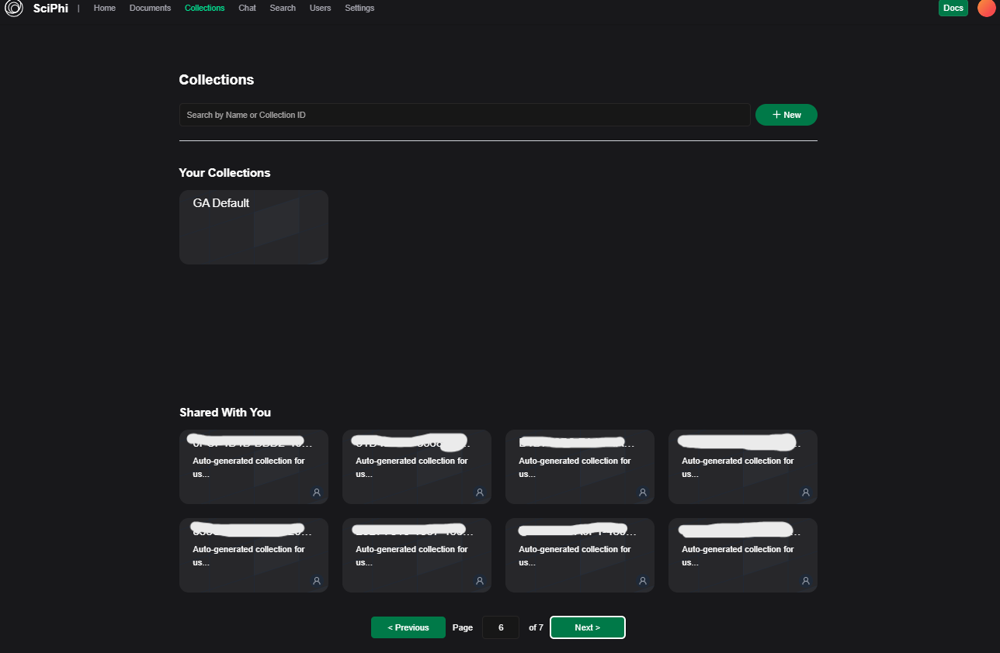
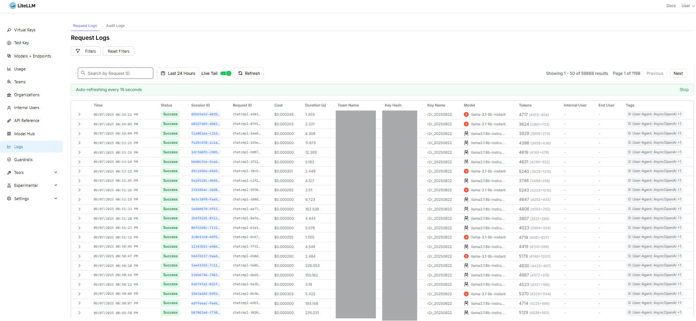

# Nextcloud Assistant – Context Chat Backend (CCBE)
**Pluggable retrieval backends with upstream-compatible defaults.**

This fork introduces a thin **adapter layer** that lets administrators choose the retrieval store and RAG/Graph-RAG implementation **without changing** Context Chat’s public API or user experience.

- **Default (no config):** behaves exactly like upstream CCBE (builtin store).
- **Opt-in:** select an external backend (e.g., **R2R Graph RAG**, Pinecone, Supabase) via environment variables only.
- **Same endpoints, same shapes:** request/response contracts and status codes are identical across backends.

---

## Why this exists

RAG and Graph-RAG are evolving quickly. Bundling a single implementation inside CCBE creates operational and strategic constraints for large Nextcloud estates:

- **Operations & risk:** Nextcloud admins can’t independently scale, patch, or migrate very large embedding/graph stores when these are tightly coupled to CCBE.
- **Technology choice:** Sites differ—GPU availability, model policy, preferred vector DB, and graph engines. A fixed in-tree RAG stack can be sub-optimal.
- **Ecosystem reuse:** A decoupled store can serve multiple apps (e.g., OpenWebUI or internal agents) instead of being hardwired to Context Chat.

A **pluggable backend** restores admin control and vendor neutrality while keeping CCBE stable for end-users.

---

## What changes (and what does **not**)

- ✅ **No change for default users**: leave `RAG_BACKEND=builtin` (or unset) and CCBE behaves like upstream.
- ✅ **Backends are swapped by config**: set a single env var and point to your retrieval service.
- ✅ **API compatibility**: endpoint paths, payloads, and status codes are preserved.
- ✅ **Small surface**: the adapter is thin; CCBE remains the “contract owner”.

---

## Architecture at a glance

```

Nextcloud (Context Chat app)  
│ HTTP/OCS (unchanged)  
▼  
Context Chat Backend (CCBE)  
│ Adapter boundary (env-selected)  
▼  
┌──────────────────────────────┬──────────────────────────────┬──────────────────────────────┐  
│ builtin (upstream default) │ R2R Graph RAG (external) │ other providers (scaffold) │  
│ • local vector store │ • collections & graphs │ • pinecone / supabase / ... │  
│ • embeddings in-process │ • dedup (doc→chunk→graph) │ • implement same contract │  
└──────────────────────────────┴──────────────────────────────┴──────────────────────────────┘


````

**Permissions model (R2R example).** CCBE sends a `userIds` header → adapter maps user/group to **collection filters**; queries only traverse collections the caller is allowed to see.

Visually my deployment architecture looks like this:


Given API endpoint use, there is significant component and server separation in our environment.

---

## Key benefits (R2R adapter)

- **Aggressive deduplication** from document hash down to chunk/graph nodes → less storage, faster queries.
- **Scale knobs everywhere**: choose embedding models, batch/queue sizes, index sharding, and the **query LLM** independently of CCBE’s release cadence.
- **Graph-RAG** when you need it: relations/entity graphs augment vanilla semantic search for complex corpora.
- **Separation of duties**: CCBE remains a stable Nextcloud component; R2R (or any backend) can scale independently, be upgraded, or be hosted on dedicated hardware.
- **Ecosystem reuse**: the same store can serve OpenWebUI, agents, or offline analytics.

---

## Quick start (default = upstream behavior)

No changes required—install as you do today. CCBE will use the builtin backend.

---

## Opt-in to an external backend (example: R2R)

Set these in your `.env` (or the AppAPI daemon’s env):

```env
# default behavior (no change)
RAG_BACKEND=builtin

# opt-in: R2R Graph RAG
# RAG_BACKEND=r2r
# R2R_BASE_URL=http://127.0.0.1:7272
# R2R_HTTP_TIMEOUT=300           # seconds (optional)
# R2R_API_KEY=...                # sent as X-API-Key (optional)
# R2R_API_TOKEN=...              # Bearer token (optional)
````

**Notes**

- Endpoint contracts are identical across backends.
    
- If using R2R, ensure the backend is reachable from CCBE and collections exist/are auto-provisioned during ingestion.
    

---

## Install

### Simple (typical Nextcloud setup)

1. Install **AppAPI**, **Context Chat Backend (CCBE)**, **Context Chat**, and (optionally) **Assistant** from the Apps pages.
    
2. If you want GPUs, enable GPU support in the AppAPI Deploy Daemon.
    
3. For high throughput, configure multiple background workers on the main server.
    

> CCBE’s adapter is selected purely by env—no code changes to the Nextcloud apps.

### Manual / Docker

- **Manual (venv)**  
    Create a venv, install `requirements.txt`, copy `example.env` → `.env`, set `RAG_BACKEND`, run `./main.py`.
    
- **Docker**  
    Build the image and run with `--env-file` pointing to your `.env`. Mount `persistent_storage` if you want to keep local config/logs across restarts.
    

---

## Register as an Ex-App (manual daemon example)

```bash
# 1) register a manual daemon
occ app_api:daemon:register --net host manual_install "Manual Install" manual-install http <host> <nextcloud_url>

# 2) register CCBE (adapt version/port)
occ app_api:app:register context_chat_backend manual_install --json-info \
'{"appid":"context_chat_backend","name":"Context Chat Backend","daemon_config_name":"manual_install","version":"<x.y.z>","secret":"<secret>","port":10034,"scopes":[],"system_app":0}' \
--force-scopes --wait-finish
```

Unregister with:

```bash
occ app_api:app:unregister context_chat_backend --force
```

---

## Operations

- **Logs** live under `logs/` inside the persistent directory (or the container’s data dir).
    
- **Configuration**: the effective config is `${APP_PERSISTENT_STORAGE}/config.yaml`. Adapter selection happens via env; other sections (e.g., local vectordb/embedding) are ignored when an external backend fully handles retrieval.
    

---

## Security & governance

- **Data plane isolation:** retrieval stores (and GPUs) can be isolated from the web front-end.
    
- **Least privilege:** CCBE holds only the secrets it needs to call the backend; the backend enforces collection scoping.
    
- **Compliance:** independent backup, retention, rotation, and auditing on the backend—without touching CCBE.
    

---

## Roadmap

- **Finalize the “RAG driver” contract** as a short spec (methods, status, `userIds` header, collection semantics).
    
- **Keep builtin as default** for frictionless upgrades; maintainers can merge the adapter hook now without forcing any site to change.
    
- **Out-of-tree providers** (R2R today; Pinecone/Supabase scaffolds provided).
    
- **Contrib tests**: fixtures that hit identical endpoints through each backend and compare shapes/status codes.
    

---

## Credits & Upstream Acknowledgements

This work builds on the excellent engineering by the **Nextcloud Assistant** teams, in particular:
- **Context Chat** (PHP app) – AGPL-3.0. https://github.com/nextcloud/context_chat
- **Context Chat Backend** (External App, Python) – AGPL-3.0+. https://github.com/nextcloud/context_chat_backend

We maintain API compatibility and default behaviour to remain a good citizen in the Nextcloud ecosystem.

## Special thanks

**SciPhi R2R** (https://github.com/SciPhi-AI/R2R) inspired this pluggable backend approach.
R2R demonstrates how a modern retrieval stack—multimodal ingestion, hybrid search,
Graph-RAG, and robust collections/permissions—can be exposed cleanly via a REST API.
Their implementation showed us the value of **decoupling** retrieval from application release cycles
and letting sites select best-fit stores and models operationally.

R2R is MIT-licensed and independently maintained by the SciPhi team; this repository is not
affiliated with or endorsed by SciPhi. We simply thank them for the ideas and excellent engineering.

### Third-Party Notices

This project may interoperate with third-party software and services. Notably:

- **SciPhi R2R** — MIT License. See upstream repository for license terms:
  https://github.com/SciPhi-AI/R2R

All trademarks are the property of their respective owners.

---

## Environment Setup (R2R + LiteLLM)

This section documents the deployment setup we use to integrate the R2R backend with CCBE via the pluggable backend adapter, using a LiteLLM proxy for model routing. All values below are sanitized placeholders for illustration.

- CCBE repo: `/opt/context_chat_backend` (this repository)
- Context Chat client (reference only): `/opt/context_chat`
- SciPhi R2R (reference only): `/opt/R2R`
- Persisted data/logs (CCBE): `/data/context_chat_backend`
- Persisted data (R2R stack): `/data/r2r`

### Backend Selection (CCBE)

CCBE remains upstream-compatible by default. To opt into R2R, set env vars only (no code changes):

```env
# CCBE (Context Chat Backend)
RAG_BACKEND=r2r                     # default: builtin
R2R_BASE_URL=http://r2r:7272        # or https://r2r.foo.bar
# Optional auth if your R2R requires it
# R2R_API_KEY=...                   # sent as X-API-Key
# R2R_API_TOKEN=...                 # sent as Bearer token
```

### R2R Configuration File (sanitized example)

The file `r2r.toml` is copied to `/data/r2r/docker/user_configs/r2r.toml` and mounted into the R2R container at `/app/user_configs/r2r.toml`.

Key concept: R2R uses LiteLLM as a provider. Model names are prefixed with a provider (e.g., `openai/`, `ollama/`, `anthropic/`, `mistral/`). LiteLLM reads this prefix to send the correct API call shape; the `api_base` points to the LiteLLM proxy which handles load balancing and vendor routing.

```toml
[app]
project_name = "example"
default_max_documents_per_user = 10000000
default_max_chunks_per_user = 100000000000000
default_max_collections_per_user = 10000

# User-facing, fast, VLM, etc. (provider-selected via prefix)
quality_llm   = "openai/r2r-default"
fast_llm      = "openai/r2r-fast"
vlm           = "openai/r2r-vision"
audio_lm      = "openai/whisper-1"
reasoning_llm = "openai/r2r-default"
planning_llm  = "openai/r2r-default"

[agent]
rag_agent_static_prompt  = "static_rag_agent"
rag_agent_dynamic_prompt = "dynamic_rag_agent"
rag_tools     = ["search_file_descriptions", "search_file_knowledge", "get_file_content"]
research_tools = ["rag", "reasoning", "critique", "python_executor"]

  [agent.generation_config]
  model = "openai/r2r-chat"

[auth]
provider = "r2r"
access_token_lifetime_in_minutes = 60
refresh_token_lifetime_in_days = 7
require_authentication = true
require_email_verification = false
default_admin_email = "admin@example.foo.bar"
default_admin_password = "change-me-please"

[completion]
provider = "litellm"
concurrent_request_limit = 10

  [completion.generation_config]
  model = "openai/r2r-fast"
  api_base = "https://litellm.foo.bar/v1"
  temperature = 0.1
  top_p = 1
  stream = false

[crypto]
provider = "bcrypt"

[database]
provider = "postgres"
default_collection_name = "Default"
default_collection_description = "Default collection"

batch_size = 8

  [database.graph_creation_settings]
  clustering_mode = "local"
  graph_entity_description_prompt = "graph_entity_description"
  graph_extraction_prompt = "graph_extraction"
  entity_types = ["Person", "Organization", "Project", "Concept"]
  relation_types = []
  fragment_merge_count = 1
  max_knowledge_relationships = 10
  max_description_input_length = 4096
  generation_config = { model = "openai/r2r-kg", temperature = 0, stream = false }
  add_generation_kwargs.service_tier = "default"
  add_generation_kwargs.truncate = true
  add_generation_kwargs.keep_alive = "30m"
  add_generation_kwargs.options.num_ctx = 8192
  add_generation_kwargs.stop = ["</root>"]

  [database.graph_entity_deduplication_settings]
  graph_entity_deduplication_type = "by_name"
  max_description_input_length = 4096
  generation_config = { model = "openai/r2r-kg", temperature = 0, stream = false, service_tier = "default" }

  [database.graph_enrichment_settings]
  community_reports_prompt = "graph_communities"
  max_summary_input_length = 4096
  generation_config = { model = "openai/r2r-kg", temperature = 0, stream = false, service_tier = "default" }
  leiden_params = {}

  [database.graph_search_settings]
  generation_config = { model = "openai/r2r-kg", temperature = 0.1, stream = false, service_tier = "default" }

  [database.limits]
  global_per_min = 300
  monthly_limit = 100000000

  [database.route_limits]
  "/v3/retrieval/search" = { route_per_min = 120 }
  "/v3/retrieval/rag" = { route_per_min = 30 }

[embedding]
provider = "litellm"
base_model = "openai/r2r-mxbai-embed-large"
api_base = "https://litellm.foo.bar/v1"
base_dimension = 512
batch_size = 6
add_title_as_prefix = true
concurrent_request_limit = 16
quantization_settings = { quantization_type = "FP16" }

[completion_embedding]
provider = "litellm"
base_model = "openai/r2r-mxbai-embed-large"
api_base = "https://litellm.foo.bar/v1"
base_dimension = 512
concurrent_request_limit = 16
quantization_settings = { quantization_type = "FP16" }

[file]
provider = "s3"
bucket_name = "r2r"
endpoint_url = "https://minio.foo.bar"
region_name = "us-east-1"
aws_access_key_id = "R2R_ACCESS_KEY"
aws_secret_access_key = "R2R_SECRET_KEY"

[ingestion]
provider = "unstructured_local"
ingestion_mode = "custom"
automatic_extraction = true
strategy = "auto"
chunking_strategy = "by_title"
new_after_n_chars = 2048
max_characters = 4096
combine_under_n_chars = 3072
overlap = 1024
excluded_parsers = ["xls","xlsx","csv","jpg","bmp","heic","jpeg","png","tiff","gif","css","mp3","mp4"]

  [ingestion.chunk_enrichment_settings]
  enable_chunk_enrichment = false
  strategies = ["semantic", "neighborhood"]
  forward_chunks = 3
  backward_chunks = 3
  semantic_neighbors = 10
  semantic_similarity_threshold = 0.7
  generation_config = { model = "openai/r2r-summary" }

[logging]
provider = "r2r"
log_table = "logs"
log_info_table = "log_info"
file = "/app/logs/r2r.log"
```

### R2R Environment (sanitized example)

We run R2R with an `.env` similar to the below. Note how both R2R’s own `OPENAI_*` variables and the TOML point to the same LiteLLM proxy.

```env
# ===== R2R Core =====
R2R_PROJECT_NAME=example
R2R_SECRET_KEY=
R2R_PORT=7272
R2R_HOST=0.0.0.0
R2R_LOG_LEVEL=INFO
R2R_CONFIG_PATH=/app/user_configs/r2r.toml
R2R_USER_TOOLS_PATH=/app/user_tools

NEXT_PUBLIC_R2R_DEPLOYMENT_URL=http://localhost:7272
NEXT_PUBLIC_HATCHET_DASHBOARD_URL=http://localhost:7274
NEXT_PUBLIC_R2R_DEFAULT_EMAIL=admin@example.foo.bar
NEXT_PUBLIC_R2R_DEFAULT_PASSWORD=change-me-please

# ===== Postgres for R2R =====
R2R_POSTGRES_USER=postgres
R2R_POSTGRES_PASSWORD=postgres
R2R_POSTGRES_HOST=postgres
R2R_POSTGRES_PORT=5432
R2R_POSTGRES_DBNAME=postgres

# ===== LiteLLM / Providers =====
OPENAI_API_BASE=https://litellm.foo.bar/v1
OPENAI_API_KEY=sk-<redacted>
# Optional: other providers exposed through LiteLLM
# MISTRAL_API_KEY=sk-<redacted>
# HUGGINGFACE_API_KEY=hf_<redacted>

# ===== Optional Services =====
UNSTRUCTURED_API_URL=https://api.unstructured.io/general/v0/general
UNSTRUCTURED_NUM_WORKERS=8
CLUSTERING_SERVICE_URL=http://graph_clustering:7276

# ===== Persisted Volume Paths =====
VOLUME_HATCHET_CERTS=/data/r2r/hatchetcerts
VOLUME_HATCHET_CONFIG=/data/r2r/hatchetconfig
VOLUME_POSTGRES_DATA=/data/r2r/postgresdata

# ===== Hatchet (client) =====
HATCHET_CLIENT_TLS_STRATEGY=none

# ===== SMTP (optional) =====
R2R_SMTP_SERVER=smtp.foo.bar
R2R_SMTP_PORT=25
R2R_SMTP_USERNAME=notifications@example.foo.bar
R2R_SMTP_PASSWORD=change-me-please
R2R_FROM_EMAIL=notifications@example.foo.bar
```

### How model routing works (LiteLLM)

- Prefix determines API adapter:
  - `openai/<model>` → OpenAI-compatible Chat/Embeddings API
  - `ollama/<model>` → Ollama adapter
  - `anthropic/<model>` → Anthropic adapter
  - `mistral/<model>` → Mistral adapter
- R2R sends requests to `api_base` (LiteLLM proxy). LiteLLM handles:
  - Provider-specific request shaping (e.g., OpenAI vs Anthropic)
  - Load balancing and failover across upstreams
  - Key/secret isolation (keys live in the proxy, not in CCBE)

In practice, R2R asks for `model = "openai/r2r-fast"` and posts to `https://litellm.foo.bar/v1`. LiteLLM sees the `openai/` prefix and routes to the configured OpenAI-compatible backend(s) using its internal policies.

### Docker mount notes

- `r2r.toml` source: `/opt/r2r.toml`
- Copied to: `/data/r2r/docker/user_configs/r2r.toml`
- Mounted into container: `/app/user_configs/r2r.toml`

This keeps the config persistent outside the container and simplifies upgrades.

### Docker Compose (example)

Short, sanitized example showing CCBE + R2R + LiteLLM. This is a minimal reference; for a production-grade R2R stack with Hatchet, RabbitMQ, and dashboards, consult `r2r_docker_compose.yaml` in `/opt`.

```yaml
version: '3.9'
services:
  litellm-proxy:
    image: ghcr.io/berriai/litellm:latest
    command: ["--port", "8000"]
    environment:
      # Provide provider keys here; LiteLLM will route per model prefix
      OPENAI_API_KEY: "sk-<redacted>"
      # MISTRAL_API_KEY: "sk-<redacted>"
      # ANTHROPIC_API_KEY: "sk-ant-<redacted>"
    ports:
      - "8000:8000"

  postgres:
    image: pgvector/pgvector:pg16
    environment:
      POSTGRES_DB: postgres
      POSTGRES_USER: postgres
      POSTGRES_PASSWORD: postgres
      PGDATA: /var/lib/postgresql/data/pgdata
    volumes:
      - /data/r2r/postgresdata:/var/lib/postgresql/data
    healthcheck:
      test: ["CMD-SHELL", "pg_isready -U postgres"]
      interval: 10s
      timeout: 5s
      retries: 5

  r2r:
    image: sciphiai/r2r:latest
    env_file:
      - ./r2r.env   # sanitized example in this README
    volumes:
      - /data/r2r/docker/user_configs/r2r.toml:/app/user_configs/2r.toml:ro
      - /data/r2r/logs:/app/logs
    ports:
      - "7272:7272"
    depends_on:
      - litellm-proxy
      - postgres

  ccbe:
    build:
      context: .
      dockerfile: Dockerfile
    env_file:
      - ./ccbe.env # set RAG_BACKEND=r2r and R2R_BASE_URL=http://r2r:7272
    volumes:
      - ./persistent_storage:/app/persistent_storage
    ports:
      - "10034:10034"
    depends_on:
      - r2r
```

Notes
- `litellm-proxy` listens on `:8000`. The R2R TOML and env point `api_base`/`OPENAI_API_BASE` to `http://litellm-proxy:8000/v1`.
- `r2r.env` should point `R2R_POSTGRES_HOST=postgres` and `OPENAI_API_BASE=http://litellm-proxy:8000/v1` as shown in the sanitized env above.
- For full R2R features (batch ingestion, dashboards), use the full compose in `/opt/r2r_docker_compose.yaml` which includes Hatchet and RabbitMQ.
- Templates: see `context_chat_backend/ccbe.env.example` and `context_chat_backend/r2r.env.example` for copy/paste env files.
- Production note: in our environment, LiteLLM configuration runs on a separate server; R2R uses the LiteLLM Python library and sends OpenAI‑compatible calls to that proxy. The `litellm-proxy` service shown here is optional for local testing—omit it in production and set `OPENAI_API_BASE`/`api_base` to your remote proxy URL.

### Production Compose (sanitized)

Use a production-style compose that includes R2R, Hatchet (engine + dashboards), RabbitMQ, Postgres, Unstructured, Graph Clustering, and LiteLLM. A sanitized copy is provided at:

- `context_chat_backend/docker-compose.r2r-prod.example.yaml`

Quick start
- Copy env templates:
  - `cp context_chat_backend/ccbe.env.example context_chat_backend/ccbe.env`
  - `cp context_chat_backend/r2r.env.example context_chat_backend/r2r.env`
- Put your TOML at `/data/r2r/docker/user_configs/r2r.toml` (as mounted by the compose).
- Start the stack:
  - `docker compose -f context_chat_backend/docker-compose.r2r-prod.example.yaml up -d`

Security notes
- Restrict management UIs to trusted networks: RabbitMQ `15673`, Hatchet Dashboard `7274`, R2R Dashboard `7273`.
- Consider binding `litellm-proxy` to `127.0.0.1:8000` or placing it behind an internal network/load balancer.
- Store real secrets in a secrets manager or `.env` files not committed to source control.

---

## Benefits Of This Setup

- **Pluggable backend:** swap `builtin`/`r2r` via env; upstream endpoints remain unchanged.
- **Operational isolation:** retrieval stack scales independently from Nextcloud app servers.
- **Load‑balanced models:** R2R calls a remote LiteLLM proxy; provider selection and balancing live outside CCBE/R2R.
- **Queue visibility:** Hatchet dashboards expose ingestion/graph pipelines and retry states.
- **Dedup + cost control:** document/chunk hashing avoids repeated embeddings and uploads.
- **Collection‑scoped access:** per‑user collections enforce query/ingest visibility cleanly.

Screenshots
- Hatchet workflow runs (queue health and throughput):
  - `docs/screenshots/hatchet-workflow-runs.png`
  - Alt: “Hatchet dashboard showing queued/running/succeeded workflows”
  - 

- R2R Documents view (ingestion/extraction status at scale):
  - `docs/screenshots/r2r-documents.png`
  - Alt: “R2R Documents table with success states and actions”
  - 

- R2R Collections view (per‑user and shared collections):
  - `docs/screenshots/r2r-collections.png`
  - Alt: “R2R Collections page showing user and shared collections”
  - 

- LiteLLM Proxy backend logs (showing load balancing and routing across servers)
  - `docs/litellm_proxy.png`
  - Alt: "LiteLLM Proxy backend logs (showing load balancing and routing across servers)"
  - 

### Reverting to upstream behavior

Set `RAG_BACKEND=builtin` (or unset it) and restart CCBE. No other changes required.

## What would be nice (aspiration)

Adopt a **minimal abstract RAG driver** in Context Chat Backend:

- Keep the **built-in backend as the default** (no changes for existing users).
- Provide a **tiny, stable driver interface** (methods, status, and a small set of request/response shapes).
- Pass **user/group context** (e.g., `userIds`) from CCBE; drivers enforce collection-level filtering.
- Allow **out-of-tree providers** (e.g., R2R, Pinecone, Supabase, Neo4j) to plug in via configuration only.
- Preserve **API compatibility and operational neutrality**—admins can scale/upgrade retrieval independently of CCBE releases.

This keeps Nextcloud vendor-neutral and stable, while enabling teams to use best-fit retrieval stacks. R2R’s clean API surface is a working proof that this pattern is practical today.

---

## Why R2R specifically (rationale and fit)

R2R (SciPhi) exposes a clean, capability‑rich HTTP API for document ingestion, hybrid/semantic search, and optional graph construction. It is a good match for CCBE because:

- Collections as tenancy: R2R models access as per‑tenant/per‑user collections. CCBE can pass `userIds` and the adapter can scope every query to only those collections.
- Document‑centric API: Create/update/delete documents with server‑side hash filtering and metadata updates; avoid client‑side scan/joins.
- Graph‑RAG optionality: Enable entity/relationship graphs where useful, without forcing it for simple deployments.
- Independent scaling: R2R workers, queues, and model endpoints scale outside of CCBE’s lifecycle.

See also: `R2R-Integration.md` for more background and deployment notes.

---

## Collections‑based access model (user → collection) 

CCBE never sends raw user ACLs to the backend at query time. Instead the adapter translates user context to R2R collections and uses these as filters:

- Ensure collections: On every ingestion call, CCBE resolves the `userIds` header and calls `GET /v3/collections`; missing entries are created with `POST /v3/collections { name: <userId> }`.
- Ingest scope: New or existing documents are associated with the set of collection IDs for all `userIds` in the request.
- Query scope: Search/RAG requests include a filter: `filters: { collection_ids: { $overlap: [ userId ] } }` (or the resolved collection IDs), ensuring hits only from the caller’s collections.
- Access updates: Grant/revoke operations add/remove the document from the corresponding user collections.

This keeps the user access layer simple, auditable, and entirely enforced on the retrieval side.

---

## Endpoint mapping (CCBE ⇄ R2R)

High‑level map of how CCBE endpoints translate into R2R calls when `RAG_BACKEND=r2r`:

- `PUT /loadSources` →
  - `GET /v3/collections` (list) → `POST /v3/collections` (create missing)
  - For each source: dedup by hash via `POST /v3/retrieval/search` (query "*" with metadata filter)
  - `GET /v3/documents/{id}` to read authoritative fields when needed
  - Create or update document via `POST /v3/documents` (multipart) and `PUT /v3/documents/{id}/metadata`
  - Add/remove collection membership: `POST/DELETE /v3/collections/{cid}/documents/{id}`

- `POST /updateAccessDeclarative` →
  - `GET /v3/documents/{id}/collections` then reconcile with `POST/DELETE /v3/collections/{cid}/documents/{id}`

- `POST /updateAccess` (allow/deny) →
  - `POST/DELETE /v3/collections/{cid}/documents/{id}`

- `POST /deleteSources` → `DELETE /v3/documents/{id}` (by identifier)

- `POST /countIndexedDocuments` → `GET /v3/documents` (count client‑side)

- `POST /query` and `POST /docSearch` → `POST /v3/retrieval/rag` with collection filter and optional scope

For a detailed walkthrough with file/line references, see `docs/ccbe_r2r_mapping.md` and `R2R-Integration.md`.

---

## Backpressure and timeouts: how we keep scans alive

Large batches and upstream spikes used to surface as 500s/timeouts for the Nextcloud client. We implemented a minimal, upstream‑compatible strategy focused on two goals: avoid timeouts and make every busy condition retryable.

What we do now
- Caller‑side gate in the R2R adapter:
  - Cap concurrent upserts from CCBE (`R2R_MAX_INFLIGHT_UPSERTS`).
  - Optional quick wait (`R2R_MAX_WAIT_SECONDS`) to see if capacity returns.
  - If still busy/timeout/502–504, raise a small `RetryableBackendBusy` with the specific `source_id`.
- Central response shaping in `main.py`:
  - For `/loadSources`, map `RetryableBackendBusy` to HTTP 200 with body:
    `{ "loaded_sources": [], "sources_to_retry": ["<source_id>"] }`
  - For other routes, return HTTP 503 with header `cc-retry: true` and optional `Retry-After`.

Why this works
- The Context Chat client expects either success with `sources_to_retry` or a retryable signal. Returning 200 for `/loadSources` keeps the scanner’s queue alive and moves on to other files; that single source is re‑queued automatically.
- We removed complex queue probing by default; local, caller‑side signals are enough and reduce false positives.

Tuning knobs (env)
- `R2R_MAX_INFLIGHT_UPSERTS` (default 3): cap concurrent creates from CCBE to R2R.
- `R2R_MAX_WAIT_SECONDS` (default 10): small grace period before responding.
- `R2R_RETRY_AFTER_SECONDS` (default 10): included on 503 responses for non‑/loadSources.
- `R2R_HEALTH_MAX_RTT_MS` (default 0 = disabled): EWMA latency‑based gating; can be re‑enabled if desired.
- RabbitMQ mgmt probe is disabled by default; re‑enable via `QUEUE_HEALTH_URL` et al. if your ops need it.

Related guardrails
- Upsert skip windows cache: `R2R_SKIP_UPSERT_ALL_WITHIN_SECS` and `R2R_SKIP_UPSERT_META_WITHIN_SECS` avoid re‑ingesting recently seen content.
- Local exclude list: `R2R_EXCLUDE_EXTS` lets CCBE skip uploads the R2R policy would reject (e.g., `.xls,.xlsx`).

---

## Upsert caching (duplicate‑avoidance) — how it works and how to tune it

Goal: avoid re‑sending the same content to R2R across retries and re‑runs, and minimize server‑side dedup traffic when nothing changed.

Design
- Content key: a file’s SHA‑256 hash (computed in CCBE). The adapter stores a small cache entry keyed by this digest.
- Persisted cache: JSON at `/app/persistent_storage/r2r_upsert_cache.json` (inside the CCBE container). Make sure your deployment mounts `persistent_storage/` so this survives restarts.
- Entry shape: `{ "ts": <unix‑seconds>, "doc_id": <uuid|string>, "filename": <source id> }`.
- Two skip windows driven by env:
  - `R2R_SKIP_UPSERT_ALL_WITHIN_SECS`: if we saw this hash within the window, CCBE returns immediately without any network calls (logged as “Quick‑skip all …”). This is the fastest path and prevents costly upstream work during large rescans.
  - `R2R_SKIP_UPSERT_META_WITHIN_SECS`: if the content is unchanged within this longer window, CCBE bypasses duplicate checks/metadata PUTs (logged as “Quick‑skip meta …”), but can still adjust collection membership on other paths when needed.
- Cache refresh: on every successful create/update (or when R2R reports an existing document with matching hash), CCBE refreshes the entry’s timestamp. This keeps hot content hot.

Seeding the cache (optional, for large pre‑indexed corpora)
- API walk: iterate `GET /v3/documents`, take `metadata.sha256`, and seed the local cache without re‑uploads: `R2rBackend().seed_upsert_cache()`.
- Export stream: for very large sets, stream `POST /v3/documents/export` and parse a compact CSV (`id,title,metadata`) to seed quickly: `R2rBackend().seed_upsert_cache_from_export()`.
- One‑off example (run in the CCBE container):
  - `python - <<'PY'
from context_chat_backend.context_chat_backend.backends.r2r import R2rBackend
b = R2rBackend()
print(b.seed_upsert_cache())
PY`

Admin guidance
- Recommended windows for busy sites:
  - `R2R_SKIP_UPSERT_ALL_WITHIN_SECS=172800` (2 days)
  - `R2R_SKIP_UPSERT_META_WITHIN_SECS=345600` (4 days)
- Monitor logs for: “Upsert skip windows”, “Quick‑skip all …”, “Quick‑skip meta …”. Large rescans should collapse to skips after the first pass.
- Mirror R2R’s excluded types (`r2r.toml`) in CCBE via `R2R_EXCLUDE_EXTS` so excluded files never upload.

---

## Configuration quick reference (R2R)

Essential
```env
RAG_BACKEND=r2r
R2R_BASE_URL=http://<host>:7272
R2R_API_KEY=...            # optional
R2R_API_TOKEN=...          # optional
R2R_HTTP_TIMEOUT=300       # optional
```

Performance and stability
```env
# Caller-side backpressure (recommended)
R2R_MAX_INFLIGHT_UPSERTS=3
R2R_MAX_WAIT_SECONDS=10
R2R_RETRY_AFTER_SECONDS=10
# Latency gate (off by default)
R2R_HEALTH_MAX_RTT_MS=0
# Skip windows to avoid needless re‑ingest
R2R_SKIP_UPSERT_ALL_WITHIN_SECS=172800
R2R_SKIP_UPSERT_META_WITHIN_SECS=345600
# Optional local file excludes
R2R_EXCLUDE_EXTS=.tsv,.csv,.xls,.xlsx,.bmp,.heic,.jpeg,.jpg,.png,.tiff
```

Optional (ops)
```env
# RabbitMQ mgmt probe (disabled by default)
QUEUE_HEALTH_URL=http://<r2r-host>:15673
QUEUE_HEALTH_USER=user
QUEUE_HEALTH_PASSWORD=password
QUEUE_MAX_MESSAGES=0
QUEUE_MAX_PER_CONSUMER=0
```

---

## Admin settings guide (profiles)

- Small (single node, modest batches)
  - `R2R_MAX_INFLIGHT_UPSERTS=2`
  - `R2R_MAX_WAIT_SECONDS=8`
  - `R2R_RETRY_AFTER_SECONDS=8`
  - `R2R_SKIP_UPSERT_ALL_WITHIN_SECS=172800`, `R2R_SKIP_UPSERT_META_WITHIN_SECS=345600`
  - `R2R_EXCLUDE_EXTS` aligned to your `r2r.toml`

- Medium (several workers, embeddings healthy)
  - `R2R_MAX_INFLIGHT_UPSERTS=3`
  - `R2R_MAX_WAIT_SECONDS=10`
  - `R2R_RETRY_AFTER_SECONDS=10`
  - Same skip windows as above

- High throughput (scaled embeddings/queues)
  - `R2R_MAX_INFLIGHT_UPSERTS=4–6` (raise gradually and observe)
  - `R2R_MAX_WAIT_SECONDS=10–15`
  - Consider re‑enabling RTT gate (`R2R_HEALTH_MAX_RTT_MS=1500–2000`) if you want automatic slowdown on rising latency.

General advice
- Prefer small wait + fast retry; the Context Chat client handles `sources_to_retry` gracefully and progresses other files.
- Scale in‑flight caps only after embeddings and R2R workers scale.
- Seed the upsert cache before big rescans; most files should short‑circuit.

## Troubleshooting (field notes)

- “At least one source is already being processed…”
  - Early behavior on 503/timeout. Now mitigated: `/loadSources` responds 200 with `sources_to_retry`, so the scanner continues.

- R2R shows “main thread may be blocked” yet RabbitMQ looks idle
  - The backlog was inside the HTTP request path (synchronous work, upstream latency). Caller‑side caps and quick retries are designed to prevent this manifesting as a client timeout.

- After restart, “old” items complete
  - Hatchet stores runs/steps in Postgres and rehydrates queues on restart; documents created at 03:00 can finish at 07:30 and retain their original `created_at`.

- Embeddings timeouts / litellm 500s
  - Expand capacity or route embeddings to a healthy provider. CCBE will mark the file for retry and proceed with the rest of the batch.

---

## Data flow (ingest → search)

1) Client calls `PUT /loadSources` with files + `userIds` headers.
2) Adapter ensures per‑user collections; dedups by document hash; creates/updates documents; associates them with user collections.
3) Optional extraction/graph steps run asynchronously (Hatchet) in R2R.
4) Queries (`/query`, `/docSearch`) call `POST /v3/retrieval/rag` with collection filters and optional scope.
5) Answers are returned with normalized hits; access is enforced by collection membership.

This pattern keeps CCBE’s contract stable and lets R2R evolve independently (models, queues, and graph features) without affecting the Nextcloud integration.
